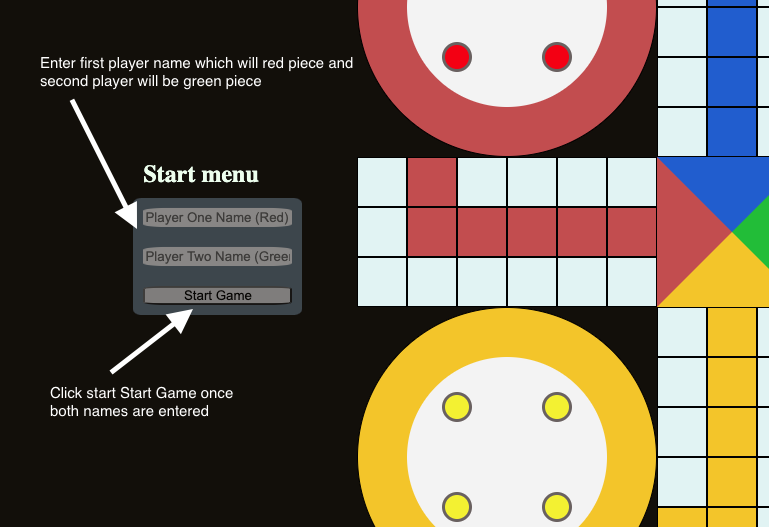

# Ludo Board Game

## About game: 
This game is called Ludo which originated from the Indian game called Pachisi. This is a very popular game around the world, which is played by 2-4 players. Players will take their pieces from start to finish according to the roll dice. Whoever takes all four pieces to the end will be the winner.  

## How to Play?
Currently Two players (more players feature will be added later) 

### Rules:
    - Each player will have all four pieces out of play which is in their base of color

    - To get a piece in play, the player must roll a six, and that piece will be moved to the start/safe position 

    - Other player pieces can land in safe spot without getting killed  

    - If player has no pieces in play and rolls anything other than six then player turn is skipped 

    - The player can keep rolling if they hit six

    - If player has a piece in play and a piece out of play and rolls a six then the player can either decide to move a piece in play or bring a piece out of base (player will roll again if six) 

    - If player rolls any other number then six then player piece can move that many spaces if player has piece in play

    - If player piece lands on a different color then other player piece is returned back to base and is out of play
    
    - If player piece lands on same colour piece then player cannot make that move and will skip turn if no other move available 

    - Player can land on own color in home column 

    - A piece can only be moved to home triangle by exact throw

    - To win first player to take all four pieces to home triangle will win

### UI Screenshots: 
Start game: 

## Wireframe:

## Technologies Used:
    - HTML
    - CSS  
    - JavaScript
    - jQuery

## Approach: 
Explain your approach to develop the app/game

## Challenges: 
List any challenges and how you overcame them
Indicate any outstanding problems

## Additional information:
Add anything else you would like us to know 

## App Demo 
Link to app: https://ifrah1.github.io/ludo-game/